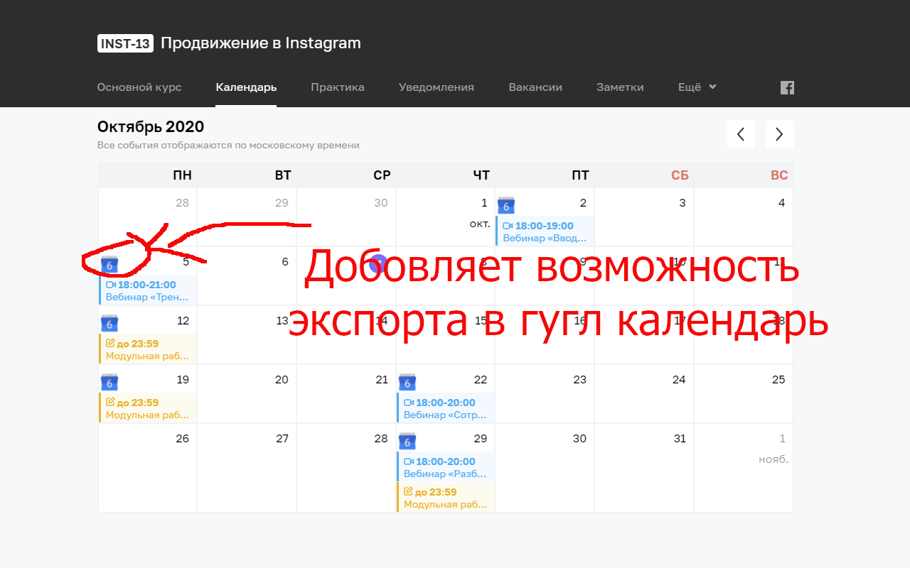
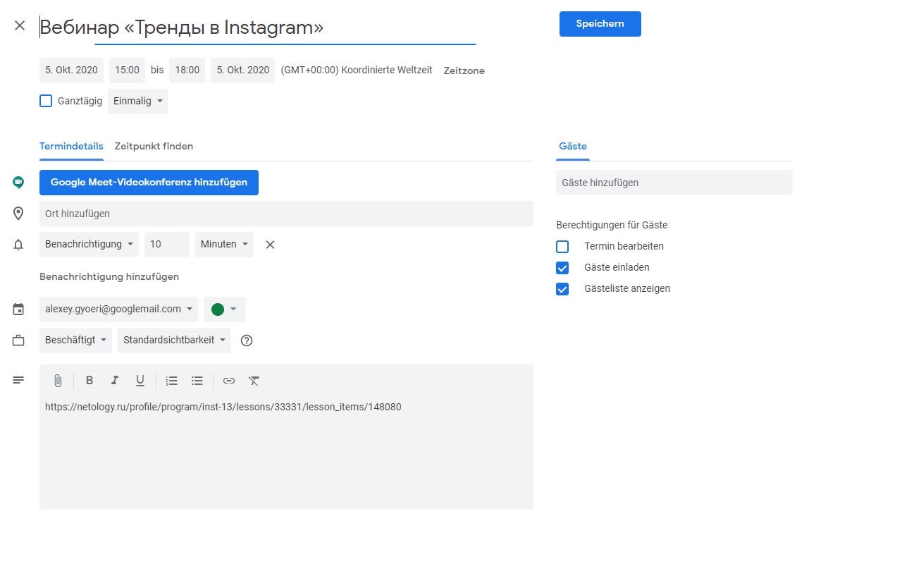

# Netology export events to Google Calendar

build via `bash distribute.sh`

## screenshots

 

## depends on
- imagemagick for icon generation `choco install `
- zip on windows `choco install zip`

## Favicon generation 
- use https://favicon.io/emoji-favicons/ to get the big image and put it into images_raw
- https://stackoverflow.com/questions/40456998/a-batch-script-to-resize-images

run the `create_images.sh` script
